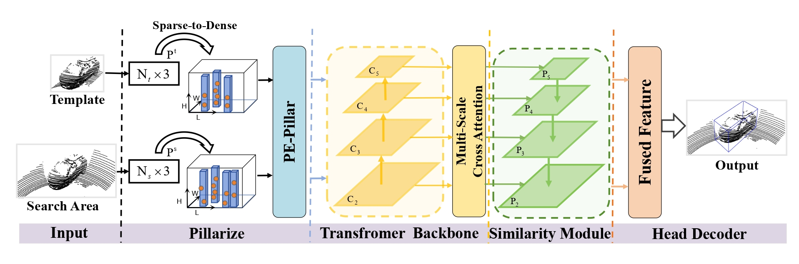

# PillarTrack: Redesigning Pillar-based Transformer Network for Single Object Tracking on Point Clouds
## Overview

- [Introduction](#introduction)
- [Performance](#performance)
- [Setup](#setup)
- [QuickStart](#quickstart)
- [Acknowledgment](#acknowledgment)
<!-- - [Citation](#citation) -->

## Introduction

This is the official code release of the paper "**PillarTrack: Redesigning Pillar-based Transformer Network for Single Object Tracking on Point Clouds**"

### Abstract
LiDAR-based 3D single object tracking (3D SOT) is a critical issue in robotics and autonomous driving. It aims to obtain accurate 3D BBox from the search area based on similarity or motion. However, existing 3D SOT methods usually follow the point-based pipeline, where the sampling operation inevitably leads to redundant or lost information, resulting in unexpected performance. To address these issues, we propose PillarTrack, a pillar-based 3D single object tracking framework. Firstly, we transform sparse point clouds into dense pillars to preserve the local and global geometrics. Secondly, we introduce
a Pyramid-type Encoding Pillar Feature Encoder (PE-PFE) design to help the feature representation of each pillar. Thirdly, we present an efficient Transformer-based backbone from the perspective of modality differences. Finally, we construct our PillarTrack tracker based above designs. Extensive experiments on the KITTI and nuScenes dataset demonstrate the superiority of our proposed method. Notably, our method achieves state-of-the-art performance on the KITTI and nuScenes dataset and enables real-time tracking speed.



## Performance

### Kitti Dataset

|           | Car  | Ped  | Van  | Cyclist  | Mean  |
| --------- | ---- | ---- | ---- | -------- | ----- |
| Success   | 74.2 | 59.7 | 43.4 | 77.4     | 65.3  |
| Precision | 85.1 | 84.7 | 51.7 | 94.2     | 82.2  |

### NuScenes Dataset

|           | Car   | Ped   | Truck  | Trailer | Bus  | Mean  |
| --------- | ----- | ----- | ------ | ------- | ---- | ----  |
| Success   | 47.12 | 34.18 | 54.82  | 57.70   | 44.68| 44.59 |
| Precision | 57.72 | 64.93 | 54.41  | 54.63   | 40.73| 58.86 |


## Setup

### Installation

   ```bash
   conda create -n pillartrack python=3.8 -y
   conda activate pillartrack
   
   pip install torch==1.8.1+cu111 torchvision==0.9.1+cu111 torchaudio==0.8.1 -f https://download.pytorch.org/whl/torch_stable.html
   
   # please refer to https://github.com/traveller59/spconv
   pip install spconv-cu111

   git clone https://github.com/StiphyJay/PillarTrack.git
   cd pillartrack
   pip install -r requirements.txt

   python setup.py develop
   ```

### Dataset preparation

   Download the dataset from [KITTI Tracking](http://www.cvlibs.net/datasets/kitti/eval_tracking.php), [nuScenes Full Dataset](https://www.nuscenes.org/download) and organize the downloaded files as follows:

   ```bash
   pillartrack                                           
   |-- data                                     
   |   |-- kitti
   │   │    ├── calib
   │   │    ├── label_02
   │   │    └── velodyne
   │   │-- nuscenes
   │   │    ├── v1.0-trainval
   │   │    ├── samples
   │   │    ├── sweeps
   │   │    └──  maps 
   ```

## QuickStart

### Train

For training, you can customize the training by modifying the parameters in the yaml file of the corresponding model, such as '**CLASS_NAMES**'.

After configuring the yaml file, run the following command to parser the path of config file and the training tag.

```bash
cd pillartrack/tools
python train_truck.py --cfg_file $model_config_path --extra_tag $cate
```

For training with ddp, you can execute the following command ( ensure be root dir ):

```bash
cd pillartrack/tools
bash dist_train.sh $NUM_GPUs --cfg_file $model_config_path
```

### Eval

```bash
cd pillartrack/tools
# for single model
python test_truck.py --cfg_file $model_config_path --ckpt $your_saved_ckpt
# for all saved model
python test_truck.py --cfg_file $model_config_path --ckpt $your_saved_ckpt --eval_all
```

For now, the code does not support ddp eval.

## Acknowledgment

- This repo is built upon [SMAT](https://github.com/3bobo/smat), [Open3DSOT](https://github.com/Ghostish/Open3DSOT) and [OpenPCDet](https://github.com/open-mmlab/OpenPCDet).  
- Thank [traveller59](https://github.com/traveller59) for his implementation of [Spconv](https://github.com/traveller59/spconv).
- Thank [fundamentalvision](https://github.com/fundamentalvision) for his implementation of [Deformable-DETR](https://github.com/fundamentalvision/Deformable-DETR).
<!-- ## Citation

If you find the project useful for your research, you may cite,

```
@ARTICLE{smat,
  author={Cui, Yubo and Shan, Jiayao and Gu, Zuoxu and Li, Zhiheng and Fang, Zheng},
  journal={IEEE Robotics and Automation Letters}, 
  title={Exploiting More Information in Sparse Point Cloud for 3D Single Object Tracking}, 
  year={2022},
  volume={7},
  number={4},
  pages={11926-11933},
  doi={10.1109/LRA.2022.3208687}}
``` -->
